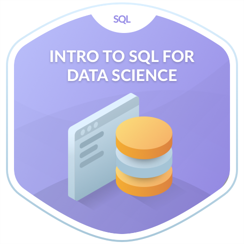
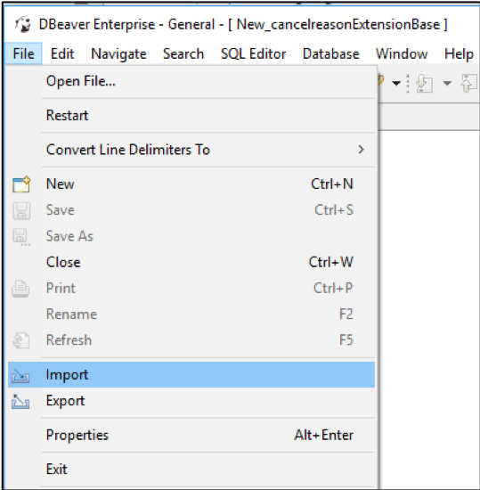
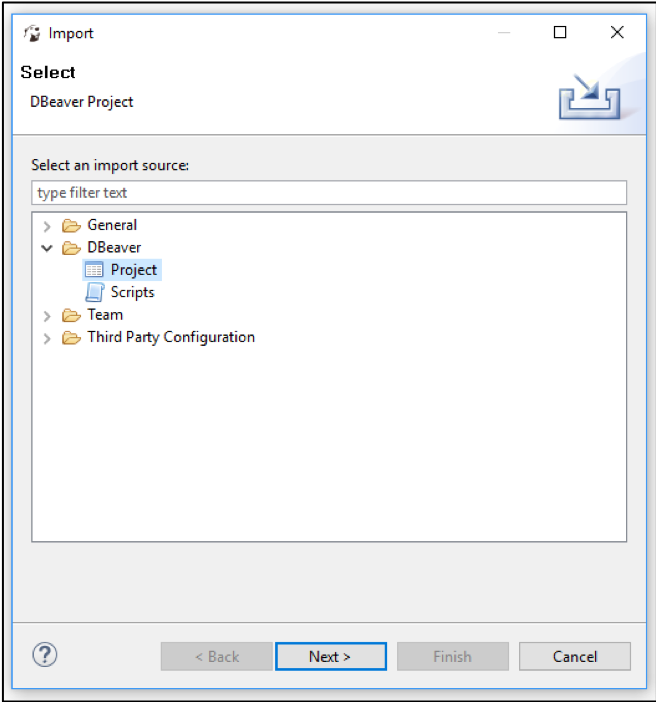
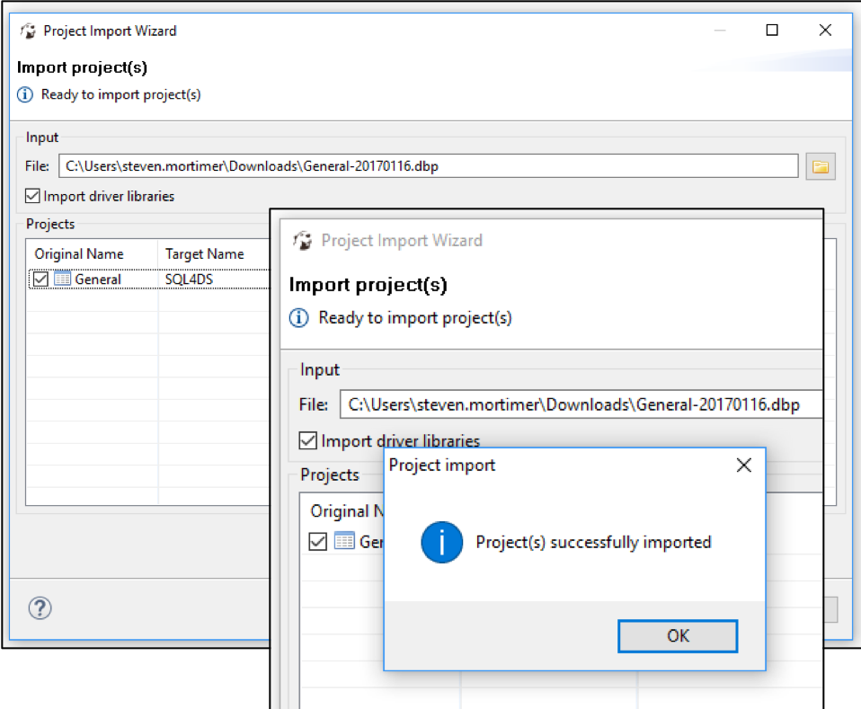
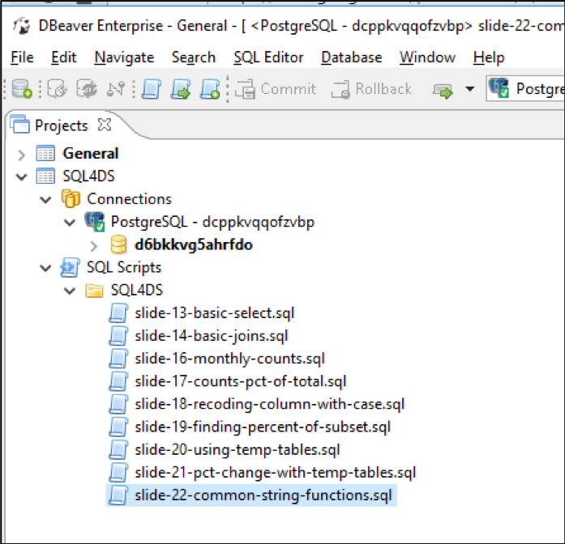

# SQL for Data Science
A repository of containing a [PowerPoint presentation](https://cdn.rawgit.com/DardenDSC/club-resources/master/presentations/sql-for-data-science/sql-for-data-science.pdf) 
covering the basics of using SQL queries to perform data science tasks. A [DBeaver Profile](https://cdn.rawgit.com/DardenDSC/club-resources/master/presentations/sql-for-data-science/DBeaver%20Profile.dbp) 
is provided so that users do not need to type in the credentials and can get a catalog 
of pre-written queries to get started quickly. The data we are analyzing is the 
AdventureWorks dataset. A dataset of a ficticious bicycle manufacturer provided by Microsoft.

## Table of Contents
 - [Getting Started](#getting-started)
   - [Installing DBeaver](#installing-dbeaver)
   - [Importing the DBeaver Profile](#importing-the-dbeaver-profile)
   - [Running a Query](#running-a-query)   
 - [The Data](#the-data)
 - [Resources to Learn SQL](#resources-to-learn-sql)
 - [Source](#source)
 
### Getting Started
The best way to learn SQL is to try it out for yourself. First, you will need a database 
that's up and running. We've set that up already. Next you need a "client", which is some 
software that allows you to connect to the database and run queries against it. We 
recommend using the DBeaver SQL Client. 

#### Installing DBeaver
You can install DBeaver Community Edition by going to http://dbeaver.jkiss.org/download/. You should see 
options to download for Windows, Mac and Linux. Follow the command prompts on your 
screen just like you would install any other software.

#### Importing the DBeaver Profile
After installing DBeaver, download a preconfigured DBeaver Profile [here](https://cdn.rawgit.com/DardenDSC/club-resources/presentations/sql-for-data-science/DBeaver%20Profile.dbp) 
and follow these steps: 

1. Open up `DBeaver -> File -> Import`
2. Select `“Project”` as the file type you would like to import and click `"Next"`
3. Select the `.dbp` file that you downloaded. Ensure that `“Import driver libraries”` is checked and 

Step 1     |  Step 2       | Step 3
:-------------------------:|:-------------------------:|:-------------------------:
  |     | 

Further installation instructions are provided on Slides 7-11 of the deck.

#### Running a Query

Once the profile is loaded you should see `"SQL4DS"` in the Projects pane on the left-hand 
side of the application. If you do not see a `“Projects”` tab, go to `“Window” -> “Projects”`. 
If you click on arrow to expand the `“SQL Scripts”` you will see pre-written scripts that 
perform different queries that are covered in the presentation. This is so you don't 
have to type them yourself. If you'd like to run one of them, double-click to open, and 
press `CRTL+ENTER`. The results should display in a table underneath the script.

 

If you have trouble installing DBeaver or importing the profile, contact a member of 
the Darden Data Science club to help you by emailing us at: DataScienceClub@darden.virginia.edu

### The Data
The data is a sampling from a ficticious dataset provided by Microsoft of a bicycle manufacturer [AdventureWorks](https://relational.fit.cvut.cz/dataset/AdventureWorks). This sampling 
only contains 3 tables: `product`, `productcategory`, and `transactionhistory`. Further, 
`transactionhistory` is a sampling of 1,000 transactions from each of the first six months of 
2017 due to constraints of how large the hosting database can be on Heroku's free tier. 
The attributes cover the data on bicycle parts/products and transactions. Below are 
the data definitions: 

**Table: product**

Variable | Data Type
---|---------
productid | integer (primary key)
name | text
productnumber | text
makeflag | integer
finishedgoodsflag | integer
color | text
safetystocklevel | float
reorderpoint | float
standardcost | float
listprice | float
size | text
sizeunitmeasurecode | text
weightunitmeasurecode | text
weight | float
daystomanufacture | float
productline | text
class | text
style | text
productsubcategoryid  | integer (foreign key)
productmodelid | integer (foreign key)
sellstartdate | timestamp
sellenddate | timestamp
discontinueddate | timestamp
rowguid | text
modifieddate | timestamp

**Table: productcategory**

Variable | Data Type
---|---------
productcategoryid | integer (primary key)
name | text
rowguid | text
modifieddate | timestamp

**Table: transactionhistory**

Variable | Data Type
---|---------
transactionid | integer (primary key)
productid | integer (foreign key)
referenceorderid | integer (foreign key) 
referenceorderlineid | integer (foreign key)
transactiondate | timestamp
transactiontype | text
quantity | float
actualcost | float
modifieddate | timestamp

### Resources to Learn SQL
There are plenty of resources to start learning SQL online. If you don't have access 
to a database then online will be the quickest and easiest way to start practicing 
writing SQL queries. Here are some of our favorite resources: 

- W3Schools: http://www.w3schools.com/sql/
- Hacker Rank: https://www.hackerrank.com/domains/sql/select
- SQL Zoo: http://sqlzoo.net/wiki/AdventureWorks
- Codecademy: https://www.codecademy.com/learn/learn-sql

### Source
The data was taken from a GitHub repository containing the full AdventureWorks dataset 
that is available here: https://github.com/infinuendo/AdventureWorks/tree/master/OLTP/Original

[Top](#sql-for-data-science)
